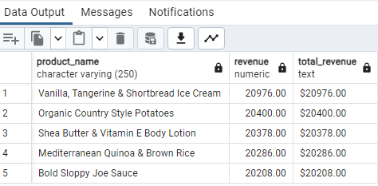
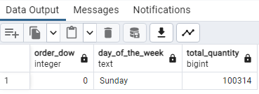
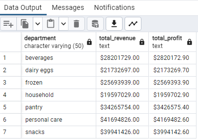
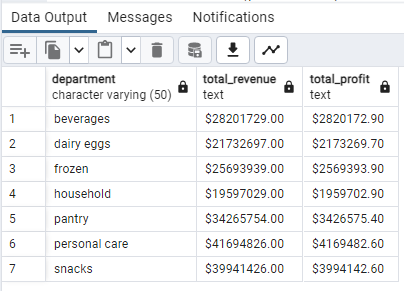
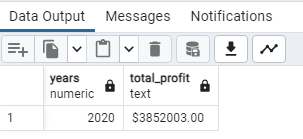
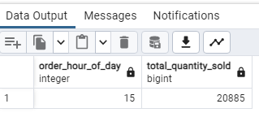
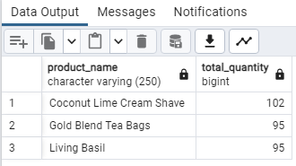

# Instacart-Sales-Report-Analysis
## by Uchechukwu Okoronkwo
___

___
# INTRODUCTION
___
Instacart is a group of stores based in the United States and Canada where customers can do online shopping using a personal shopper to fulfil and deliver their orders to them that same day. Here is how it works, using the Instacart app or website, the customer can shop for groceries (and more) from a shop near them. When the orders have been placed Instacart connect them to a personal shopper who delivers their orders to them.

This project is aimed at conducting a detailed and structured sales data analysis of Instacart's business using advanced SQL queries, by so doing providing valuable insights and answer useful business questions.
# PROJECT OBJECTIVE
___
The specific objective of this project is to use the provided dataset to unravel Instacart's operational performance customer preferences, product categories and overall financial success over a period of time. To be quite objective, I specifically coined ten business questions and answered them using unique technical SQL queries as highlighted below.
___
# SKILLS DEMONSTRATED
I used advanced technical SQL functions to import the dataset into PostgreSQL and did the analysis by imploring queries on the database I created from the dataset.
___
# DATA MODELLING
___
I specifically created a comprehensive database schema using the PostgreSQL to ensure proper organisation, efficiency and effective outcome. I created four specific tables and used the PostgreSQL to develop an ERD for the database making sure I established constraints to ensure the maintenance of data integrity.

___

___
# DATA ANALYSIS AND VISUALIZATION
___
Using the well structured data and the relationship I had established through the PostgreSQL, I pivoted towards providing insightful and valuable contributions that will influence the decision-making and strategic advancement within the business.
___
BUSINESS QUESTIONS
___
Q1 What are the top-selling products by revenue and how much revenue did they each generate?

Result

Insight; The product that sold the most was the Vanilla, Tangerine & Shortbread Ice Cream and ir generated a total of $20,976 while Organic Country Style Potatoes was the second and brought in $20,400.
___
Q2 On which day of the week are chocolate mostly sold?

Result

Insight; Chocolate was mostly sold on Sundays.
___
Q3 Do we have any department where we have made over 15 million in revenue and what is the profit?

Result

Insight; There were seven departments that made over 15 million. Beverages was the highest with over 28 million dollars in revenue and over 2 million in profit.
___
Q4 Is it true that customers bought more alcoholic products on Xmas day in 2019?

Result

Insight; Customers did not really buy more alcoholic products on Xmas of 2019.
___
Q5 Which year did Instacart generate the most profit?

Result

Insight; Instacart made its most profit in the year 2020.
___
Q6 How long has it been since the last cheese order?

Result

Insight;The last cheese order was 184 days ago.
___
Q7 What time of the day do we sell alcohol the most?

Result

Insight; Alcohol is mostly sold by 3pm.
___
Q8 What is the total revenue generated in quarters 2 & 3 of 2016 from breads alone?

Result

Insight;The total revenue generated from breads alone in the 2nd & 3rd quarters was $346,604.
___
Q9 Which three products do people buy at night from the year 2020 to 2022?

Result

Insight; The three products are Coconut Lime Cream shave, Gold Blend Tea Bags and Lving Basil.
___
Q10 What is the total revenue generated from only juice products?

Result

Insight; Revenue from juice products was $6,185,480.
___
# CONCLUSION AND RECOMMENDATIONS
From the above analysis, I was able to provide insights to some technical business questions whose answers will help to drive the business forward and generate more financial success. To develop more stategies for business growth other tools could be used to further drill the dataset for specific details. However, from the analysis done so far Instacart can pick out the year which they did so well and try to replicate it to generate as much revenue as they did that year. They could also stock up the products that sell the most and do sales for the least selling products.
